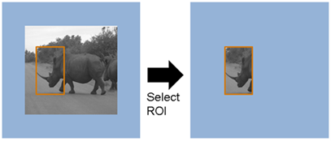

# Projet Deep Learning Classification CNN Sign 

## **Objectif au Projet**

Ce projet vise à concevoir un système de reconnaissance d'images permettant d'identifier avec précision différentes catégories de panneaux de signalisation routière. Il suit une méthodologie en neuf étapes, couvrant l'introduction et l'analyse des données, l'entraînement et l'évaluation du modèle, ainsi que des phases d'amélioration et d'expérimentation, jusqu'à l'interpération des résultats. L'approche repose sur l'apprentissage automatique, en particulier les réseaux de neurones convolutionnels (CNN), et intègre diverses stratégies d'augmentation de données et de régularisation pour optimiser les performances du modèle.

## **Contenu des données**

**Meta : Regroupe les métadonnées associées au jeu de données, incluant des informations sur chaque pictogramme, telles que son emplacement, sa forme, sa couleur et son identifiant unique.**

- Path : chemin d'accès au fichier
- ClassId : identifiant unique du pictogramme parmi les 43 classes existantes
- ShapeId : identifiant de la forme (0-triangle, 1-cercle, 2-losange, 3-hexagone, 4-triangle inversé)
- ColorId : identifiant de la couleur (0-rouge, 1-bleu, 2-jaune, 3-blanc)
- SignId : identifiant du panneau selon le code de la route ukrainien

**Training et test: Contient les images des panneaux de signalisation appartenant aux 43 classes du dataset, avec des versions augmentées pour enrichir l’entraînement et le test du modèle.** 

- Width : largeur de l’image
- Height : hauteur de l’image
- Roi.X1 : coordonnée X du coin supérieur gauche du panneau dans l’image
- Roi.Y1 : coordonnée Y du coin supérieur gauche du panneau dans l’image
- Roi.X2 : coordonnée X du coin inférieur droit du panneau dans l’image
- Roi.Y2 : coordonnée Y du coin inférieur droit du panneau dans l’image
- ClassId : identifiant de la classe correspondant à l’image (43 classes distinctes)
- Path : chemin d’accès à l’image

**La ROI (Region of Interest) est utilisée pour indiquer la zone de l'image qui contient l'objet ou la partie pertinente à analyser.**

**La région d'intérêt (ROI) est un rectangle défini par deux points :**

- Point supérieur gauche : (Roi.X1, Roi.Y1)
- Point inférieur droit : (Roi.X2, Roi.Y2)

Par exemple, pour la première ligne du dataset :
- Roi.X1 = 5, Roi.Y1 = 5 : Coin supérieur gauche de la ROI.
- Roi.X2 = 22, Roi.Y2 = 20 : Coin inférieur droit de la ROI.

Cela permet de :
- Réduire le bruit : En se concentrant uniquement sur la région pertinente, on évite de traiter des parties inutiles de l'image.
- Améliorer les performances : Les algorithmes peuvent se focaliser sur une zone spécifique, ce qui réduit la complexité et accélère le traitement.
- Annoter les données : La ROI est souvent utilisée pour annoter les objets dans les images, par exemple dans des tâches de détection d'objets ou de classification.

